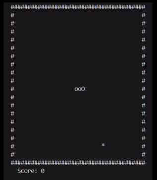

# 🐍 Snake Game in C (with ncurses)



A simple terminal-based Snake game written in **C** using the `ncurses` library.  
Built to run on Linux/WSL but works on any terminal that supports `ncurses`.

---

## 🎮 Features
- Classic snake gameplay
- Random food spawning
- Score tracking
- Lightweight and minimal
- Runs in any terminal

---

## 🛠 Requirements
- GCC or any C compiler
- `ncurses` library installed  

**On Ubuntu/WSL:**
```bash
sudo apt install libncurses5-dev libncursesw5-dev
